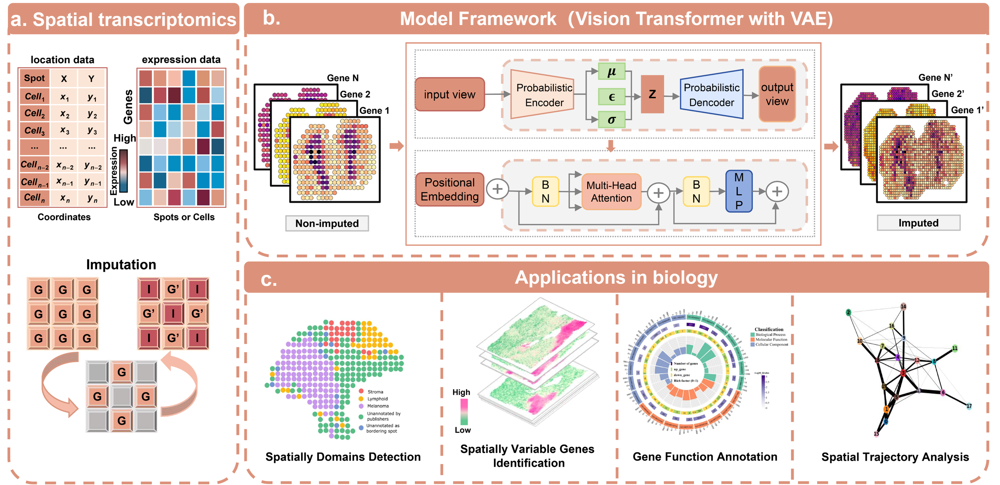

# 1.Scenario
Spatial transcriptome technology can analyze gene expression while preserving tissue spatial structure, which provides an important means for studying tumor microenvironment and disease mechanism. However, the sequencing platform represented by 10xVisium is limited by resolution, and about 70 % of the capture points cannot detect reliable gene expression information, resulting in serious data sparsity and affecting the accuracy of subsequent spatial domain identification and spatial variable gene detection. The existing interpolation methods still have deficiencies in prediction accuracy and cross-dataset generalization ability. 


In view of the above bottlenecks, this study proposes the VAEViT algorithm, which combines the global potential representation ability of the variational autoencoder and the long-range spatial dependence modeling advantage of the visual converter to achieve efficient interpolation of missing gene expression. Experiments based on datasets such as melanoma, breast cancer and invasive ductal carcinoma show that the method is significantly superior to the existing mainstream methods in tasks such as gene expression prediction, spatial domain division and variable gene recognition. It can effectively improve data quality and provide reliable technical support for tumor spatial heterogeneity analysis and precision medicine research.

# 2.Design Ideas
The core of the design of this study is : for the structural characteristics of spatial transcriptome data with high sparseness and strong noise, a combination of global representation learning and bureau is constructed. 

A deep learning interpolation framework with spatial modeling capabilities to achieve high-fidelity reconstruction of missing gene expression information. 

The overall design follows the main line of ' data adaptation-feature extraction-fusion enhancement-high resolution reconstruction '. Firstly, the spatial transcriptome expression matrix is transformed into an image-like tensor structure to adapt to the processing paradigm of computer vision model for spatial information. On this basis, the variational autoencoder ( VAE ) module is introduced to perform probabilistic latent space coding on low-resolution input, capture the global expression distribution prior and suppress technical noise. At the same time, the visual converter ( ViT ) module is introduced to model the long-range spatial dependence through patch division and multi-head self-attention mechanism to make up for the deficiency of local receptive field. The two modules are not simply connected in series, but through the fusion mechanism guided by latent representation, the global latent variables learned by VAE are injected into the token sequence of ViT as conditional information to achieve collaborative optimization of global consistency and local details. 

In terms of training strategy, a self-supervised learning framework is used to construct a ' low-resolution-high-resolution ' training pair through downsampling, which can be learned without external labeling.

Practice interpolation mapping. At the same time, the transfer learning strategy is introduced, which is pre-trained on high-quality data sets, and then transferred to low-quality data sets for fine-tuning to improve the generalization ability of cross-platform and cross-sample. Finally, end-to-end high-resolution reconstruction is achieved through sub-pixel convolution, which effectively avoids the over-smoothing problem of traditional upsampling and provides a high-quality data basis for downstream spatial domain recognition, variable gene detection and functional analysis.
# 3.Environmental Preparations
1.Install Conda / Miniconda environment, tutorials can refer to：[https://zhuanlan.zhihu.com/p/1978239735307708129](https://zhuanlan.zhihu.com/p/1978239735307708129)
2.The start bar enters`cmd`into the command line interface, so as to input the following two lines of commands to create and activate the PROST environment：
```python
conda create -n stVAT python=3.10
conda activate stVAT
```
3.Create an R environment in`stVAT` and enter the following commands in turn
```python
conda install -c conda-forge r-base
conda install -c conda-forge r-mclust=5.4.10
```
4.Install the relevant dependency package cmd switching path to the unzipped ~ stVAT-master ' root directory text, the following is Windows / Linux system distinction
If the Windows system input the following commands：
```python
pip install -r requirements_win.txt
pip install rpy2-2.9.5-cp37-cp37m-win_amd64.whl
```
If the Linux system input the following commands：
```python
pip install -r requirements.txt
```
5.Install the PROST project package, and three lines of commands are executed in turn：
```python
pip install setuptools==58.2.0
python setup.py build
python setup.py install
```
***
This completes the environment preparation.
***
## Spatial domain and spatial variable gene recognition and function research based on VAEViT algorithm
本研究分析三个来自不同组织样本的空间转录组学数据集，涵盖多种生物学背景下基因表达的空间分布情况。

现在可以打开`stVAT_master`文件夹下的`testMEL.py`，按照注释的步骤逐个运行代码，完成“基于VAEViT算法的空间域与空间可变基因识别及功能研究”数据分析。

通过这个示例，能够说明本研究算法在空间转录组数据补全、空间域界定、空间可变基因识别及基因功能阐释任务中的效果优于现有主流技术。
